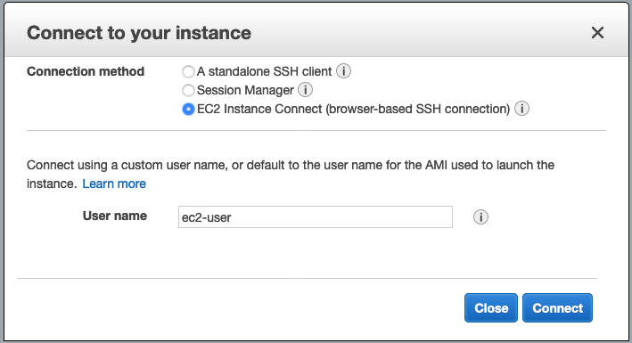
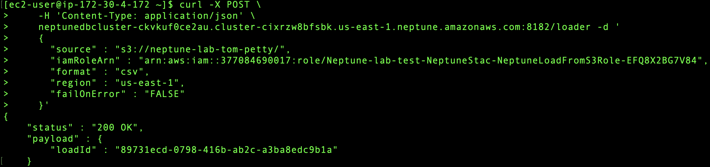
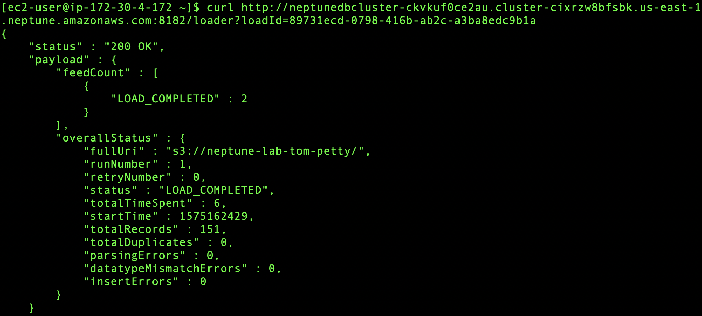

1. Descargue los siguientes archivos:

      * [**vertex.txt**](http://neptune.oldschool.cloud/vertex.txt)

      * [**edges.txt**](http://neptune.oldschool.cloud/edges.txt)

2. Diríjase a la consola de AWS y haga click en **_Services_** y posteriormente seleccione el servicio de [**_S3_**](https://s3.console.aws.amazon.com/) el cual se encuentra bajo la categoría de **_Storage_** (**_https://s3.console.aws.amazon.com/_**).
3. Haga clicl en el bucket que creó anteriormente.
4. Haga click en ***Upload*** y seleccione los dos archivos que acaba de descargar.
5. Haga click en ***Upload***.
6. Haga click en **_Services_** y posteriormente seleccione el servicio de **_EC2_** el cual se encuentra bajo la categoría de **_Compute_**.
7. Haga click en **_Running instances_**.
8. Seleccione la casilla que se encuentra a lado de la instancia **_Neptune-test_**.
9. Haga click en **_Connect_**.
10. Seleccione **_EC2 Instance Connect (browser-based SSH connection)_** y haga click en **_Connect_** para tener acceso a la instancia cliente vía SSH por medio del navegador web.




**_*Nota._** Si por alguna razón no pudo conectarse a la instancia por medio de SSH via el navegador web (500 Server error), intente la opción de A standalone SSH client siguiendo las instrucciones que ahí se indican (terminal para usuarios Mac/Linux, putty para usuarios Windows).

11. Una vez dentro de la instancia debe ejecutar el siguiente comando para cargar los datos del bucket de S3 en la base de datos de Neptune sustituyendo los siguiente parámetros:

* ***your-neptune-endpoint*** - *DBInstanceEndpoint* 
* ***arn:aws:iam::account-id:role/role-name*** - *NeptuneLoadFromS3IAMRoleArn*
    * Estos datos los obtiene de la sección de Outputs de la plantilla de CloudFormation que lanzó al inicio.
* ***your-s3-bucket*** - *el nombre de su bucket*

```
curl -X POST \
    -H 'Content-Type: application/json' \
    http://your-neptune-endpoint:8182/loader -d '
    { 
      "source" : "s3://your-s3-bucket/", 
      "iamRoleArn" : "arn:aws:iam::account-id:role/role-name",
      "format" : "csv", 
      "region" : "us-east-1", 
      "failOnError" : "FALSE"
    }'
```
Si todo fue ejecutado correctamente deberá ver un mensaja de ***"status" : "200 OK"***.



12. De la ejecución del comando anterior, guarde el valor de ***"loadId"***.
13. Verifique el status de su carga ejecutando el siguiente comando sustituyendo ***your-neptune-endpoint*** por el valor de ***DBInstanceEndpoint*** y ***[loadId value]*** por el valor de ***loadId*** del comando que ejecutó anteriormente:

```
curl http://your-neptune-endpoint:8182/loader?loadId=[loadId value]
```

