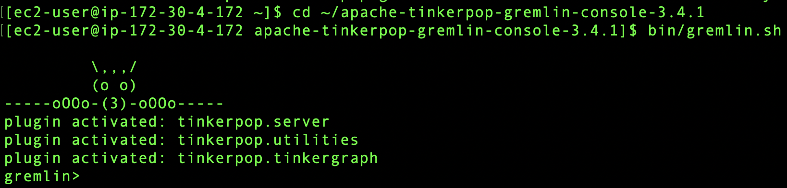

1. Conéctese de nuevo a la instancia de EC2 (pasos 6 al 10 del [**_módulo anterior_**](connect).
2. Dentro de la instancia EC2 jecute el siguiente comando y asegúrese que el valor de ***hosts*** corresponda a su cluster de Neptune (DBClusterEndpoint):

```
cat ~/ apache-tinkerpop-gremlin-console-3.4.1/conf/neptune-remote.yaml
```

3. Ejecute los siguientes comandos para iniciar la consola de Gremlin:

```
cd ~/apache-tinkerpop-gremlin-console-3.4.1
```

```
bin/gremlin.sh
```

Deberá ver la siguiente pantalla:



4. En el prompt de gremlin>, ejecute el siguiente comando para conectarse a la instancia de Neptune:

```
:remote connect tinkerpop.server conf/neptune-remote.yaml
```

5. En el prompt de gremlin>, ejecute el siguiente comando para cambiar a modo remoto. Esto envía todas las consultas de Gremlin a la conexión remota.

```
:remote console
```

6. Ingrese el siguiente comando para lanzar su primera consulta:

```
g.V().limit(1)
```

7. Proceda al [**_siguiente módulo_**](/gremlin).

8. ***Opcional***: si requiere salir de la consola de Gremlin, ejecute el siguiente comando en el prompt:

```
:exit
```