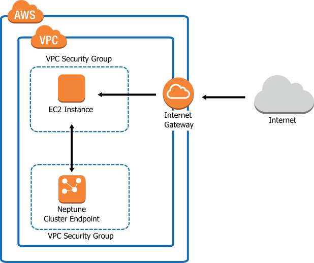

#Amazon Neptune Lab

En este laboratorio usted recorrerá las preferencias de juegos de consola de un conjunto de datos de jugadores y juegos utilizando Amazon Neptune y Gremlin. Usted cargará los datos en Amazon Neptune, explorará el gráfico y los puntos en común, descubrirá las preferencias de los jugadores mediante consultas y aprenderá cómo hacer recomendaciones de juegos usando el filtrado colaborativo.

##Amazon Neptune
Amazon Neptune es un servicio de base de datos de gráficos rápido, fiable y completamente administrado que le permite crear y ejecutar fácilmente aplicaciones que funcionen con conjuntos de datos altamente conectados. 

[!embed?max_width=1200](https://www.youtube.com/watch?v=Rl6UwE7kLio)

##Gremlin

[https://tinkerpop.apache.org/gremlin.html](Gremlin) es el lenguaje transversal de gráficos de [http://tinkerpop.apache.org/](Apache TinkerPop). Gremlin es un lenguaje funcional de flujo de datos que permite a los usuarios expresar sucintamente recorridos complejos (o consultas) del gráfico de propiedades de su aplicación.

##Cuenta de AWS requerida

Para completar este laboratorio, necesitará una cuenta de AWS activa válida con permisos de administrador. Use una cuenta personal o cree una nueva cuenta de AWS para asegurarse de tener el acceso necesario.

** Si los recursos que utiliza para este taller no se eliminan, incurrirá en cargos en su cuenta de AWS.**

Debe completar los siguientes módulos en la región Este de EE. UU. (N. Virginia) en orden antes de continuar con el siguiente.