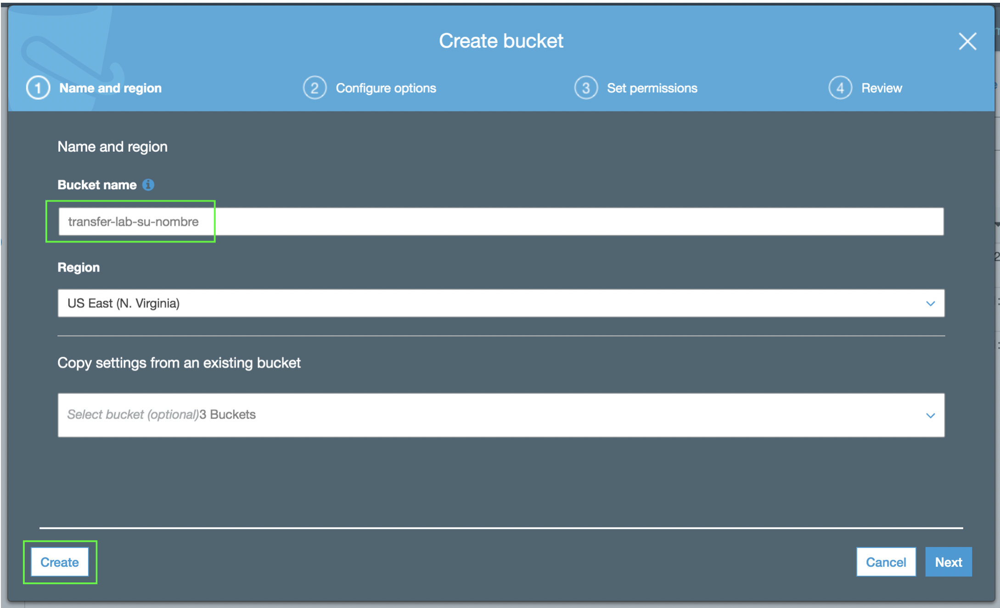

### 1. Creación de Key Pair

Lo primero que debe hacer es crear un key pair. Este key pair le permitirá acceder a las instancias que creará más adelante.

1. Asegúrese de estar trabajando en la región de **_N. Virgina_**. Esto lo puede verificar en el menú desplegable que se encuentra en la esquina superior derecha de la consola de AWS.
2. Haga click en **_Services_** y posteriormente seleccione el servicio de [**_EC2_**](https://console.aws.amazon.com/ec2/) el cual se encuentra bajo la categoría de **_Compute_**.
3. Una vez en EC2, haga click en la sección de **_Key Pairs_** que se encuentra en el menú de la izquierda.
5. Haga click en **_Create key pair_**.
6. En el campo de **_Key pair name_** ingrese un nombre para su key pair (ejemplo: **_neptune-lab_**).
7. Haga click en **_Create_** y guarde el archivo que se va a descargar.


### 2. Despliegue de plantilla de CloudFormation

A continuación, desplegará una plantilla de CloudFormation que creará el cluster de Amazon Neptune y desplegará una instancia EC2 que funcionará como su consola.

8. Haga click en **_Services_** y después en [**_CloudFormation_**](https://console.aws.amazon.com/cloudformation/) que se encuentra bajo la categoría de **_Management & Governance_** (también puede teclear CloudFormation en el campo de búsqueda).
9. Haga click en **_Create stack_**.
10.	En el campo de **_Amazon S3 URL_** ingrese la siguiente URL: 

```
https://s3.amazonaws.com/aws-neptune-customer-samples/v2/cloudformation-templates/neptune-full-stack-nested-template.json
```

11.	Haga click en **_Next_**.
12.	En el campo de **_Stack name_** escriba **_Neptune-Lab_**.
13.	En la sección de **_Parameters_** defina los siguientes valores:

* **DbInstanceType** - *db.r5.large*
* **EC2ClientInstanceType** - *t3.micro*
* **EC2SSHKeyPairName** - *Elija la llave que creó anteriormente (neptune-lab)*
* **NotebookInstanceType** - *ml.t2.medium*
* **SetupGremlinConsole** - *true*

14.	Haga click en **_Next_**.
15.	En la siguiente pantalla haga click de nuevo en **_Next_**.
16.	En la siguiente pantalla seleccione las casillas de:

**I acknowledge that AWS CloudFormation might create IAM resources with custom names.**

**I acknowledge that AWS CloudFormation might require the following capability: CAPABILITY_AUTO_EXPAND**

17.	Haga click en **_Create stack_**.
18.	Espere unos minutos a que el status de lanzamiento de la plantilla indique **_CREATE_COMPLETE_**.
19.	Una vez que el despliegue de la plantilla haya sido completado, haga click en la sección de **_Outputs_** y copie los parámetros que ahí se encuentran junto con sus valores y guárdelos en un editor de texto ya que los utilizará más adelante.


### 3. Creación de bucket de S3

En los siguientes pasos creará un bucket de S3 en donde almacenará los datos que importará a Amazon Neptune.

20. Haga click en **_Services_** y posteriormente seleccione el servicio de [**_S3_**](https://s3.console.aws.amazon.com/) el cual se encuentra bajo la categoría de **_Storage_** (**_https://s3.console.aws.amazon.com/_**).
21. Haga click en **_+ Create bucket_**.
21. Ingrese un nombre para su bucket en el campo de **_Bucket name_** con la siguiente nomenclatura: 
**_neptune-lab-su-nombre_** (ejemplo: **_neptune-lab-tom-petty_**).
22. En el menú desplegable de **_Region_** asegúrese que la región **_US East (N. Virginia)_**.
23. Haga click en **_Create_**.



24. Guarde el nombre de su bucket en un editor de texto ya que lo utilizará más tarde.

Proceda al [**_siguiente módulo_**](/cargardatos).