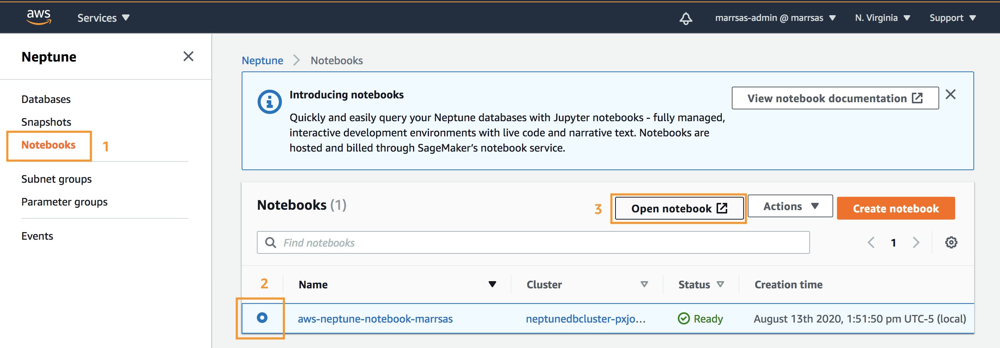
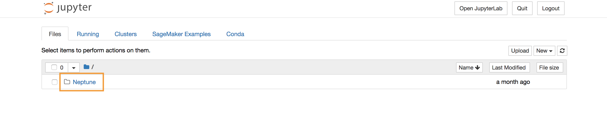
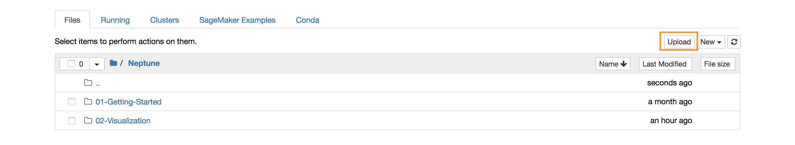
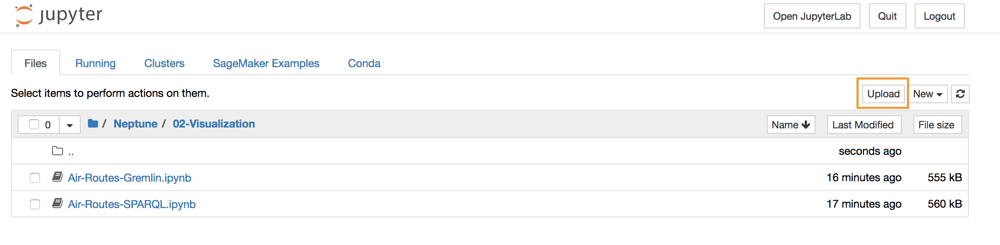
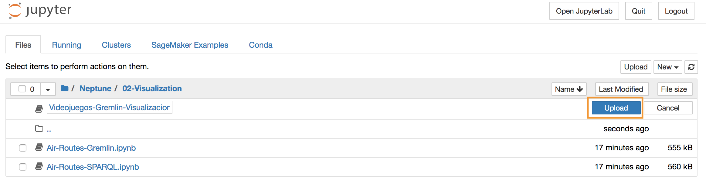
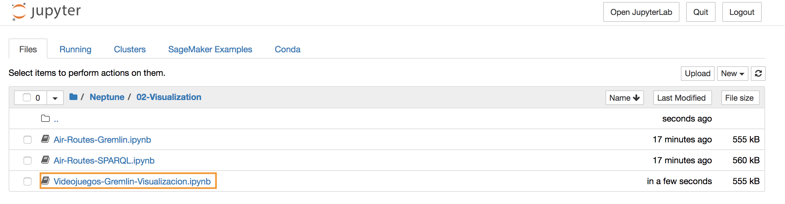

1. Haga click en **_Services_** y posteriormente seleccione el servicio de [**_Amazon Neptune_**](https://console.aws.amazon.com/neptune/) el cual se encuentra bajo la categoría de **_Database_**.

2. Haga cick en **_Notebooks_** en el menú lateral izquierdo.

3. Seleccione el cuaderno asociado a al cluster de Neptune.

4. Haga click en el boton **_Open notebook_** con lo que se abrira una nueva ventana de **_Jupyter_**.

5. Una vez abierto el cuaderno de Jupyter, hacer clic en el cuaderno de **_Neptune_**.

6. Encontrara dos folders. Seleccione el que se llama **_02-Visualization_**,

7. Dentro de este directorio encontrara dos cuadernos que contienen un ejercicio mas avanzado sobre visualizacion basado en un dataset de Rutsas Aereas (**_Air-Routes-Gremlin.ipynb_** y **_Air-Routes-SPARQL.ipynb_**). Estos podra ocuparlos si requiere mas detalle y opciones de visualizacion en Neptune. 

18. Por ahora usaremos el cuaderno [**_Videojuegos-Gremlin-Visualizacion.ipynb_**](Videojuegos-Gremlin-Visualizacion.ipynb). Descarguelo en su equipo personal y ahora procederemos a cargarlo en el directorio de Jupyter Lab.

8. Haga clic en el boton de **_Upload_**, seleccione el cuaderno **_Videojuegos-Gremlin-Visualizacion.ipynb_** que acaba de descargar y de Upload de nuevo.

9.Una vez cargado, seleccione el cuaderno haciendo clic sobre el mismo. Siga los pasos que vienen en el cuaderno.

